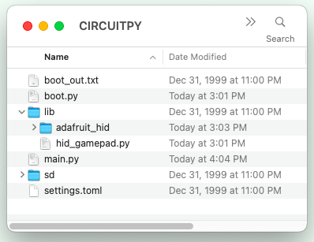
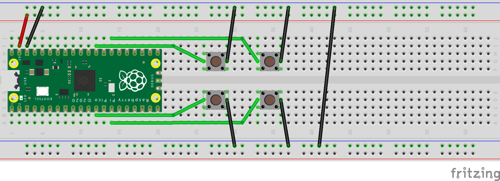

# pico_gamepad

This project is a USB gamepad, implemented on a Raspberry Pi Pico, written in CircuitPython.

Download [CircuitPython](https://circuitpython.org/downloads) for your Pico and install it. Then copy the `lib`, `boot.py`, and `main.py` files onto Pico.

Buttons should be attached to [pins on the Pico](./img/pico_pinouts.png) and then attached to the ground rails:
* `GP9` for gamepad button 1
* `GP10` for gamepad button 2
* `GP22` for gamepad button 3
* `GP21` for gamepad button 4

## References:
* [AdaFruit_CircuitPython_HID Github repository](https://github.com/adafruit/Adafruit_CircuitPython_HID/tree/main)
* [AdaFruit_CircuitPython_HID documentation](https://docs.circuitpython.org/projects/hid/en/latest/)
* [Custom HID Devices in CircuitPython](https://learn.adafruit.com/custom-hid-devices-in-circuitpython)
